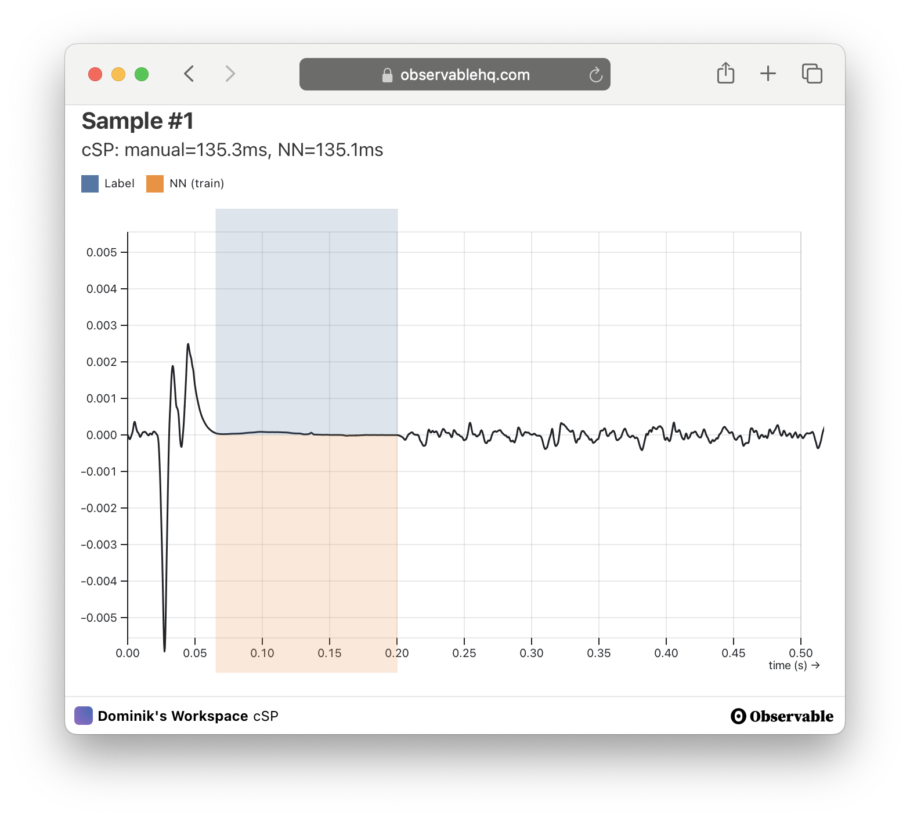

## xResnet1d

Regression on EEG data using xResnet1d to predict the cortical silent period onset and offset. Work in progress.

- Github Repository [wirhabenzeit/csp](https://github.com/wirhabenzeit/csp)

## ONNX Runtime

In-browser inference using ONNX Runtime, visualized with d3.js.

- Interactive Notebook on [Observable](http://observablehq.com/d/34cd7cc815b1602a) (takes a while to load)

<iframe width="100%" height="701" frameborder="1" class="rounded shadow"
  src="https://observablehq.com/embed/34cd7cc815b1602a@898?cells=viewof+n%2Cviewof+timelineSettings%2CexamplePlot"></iframe>
