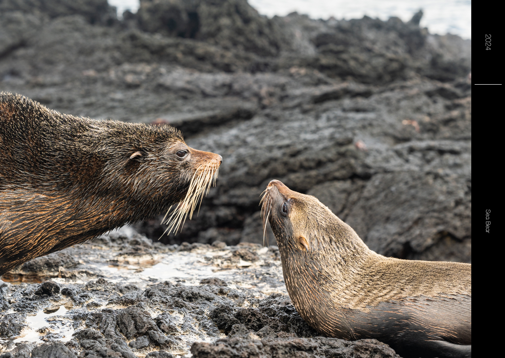
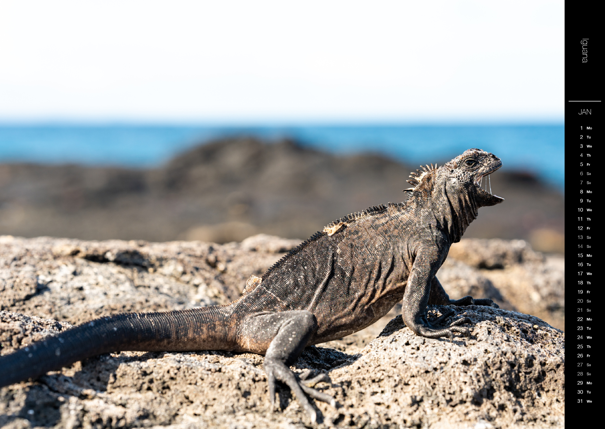

Minimalistic photo calendar in LaTeX ([Github](https://github.com/wirhabenzeit/photocal))

## Usage

```latex
\documentclass[year=2024]{photocal}

\begin{document}

\begin{page}[photo=seabear,anchor=south east,cal=false]
    \caption{\theyear}
    \subcaption{Sea Bear}
\end{page}
\begin{page}[anchor=south west,photo=iguana]
    \caption{Iguana}
\end{page}

\end{document}
```

## Output



[example.pdf](./example.pdf)

## Options

- `width` and `height` specify the size of the calendar (default: 598mm x 424mm for A2)
- `sidebarWidth` specifies the width of the sidebar (default: 40mm)
- `captionLength` specifies the height length of the caption (default: 100mm)
- `year` specifies the year of the calendar
- `startMonth` specifies the month the calendar starts with (default: 1)
- `dayWeekdaySep` specifies the separation between the day and the weekday (default: 1em)
- `daySep` specifies the separation between consecutive days (default: 9mm)

## Calendar Page

- `photo` specifies the image to be placed on the page (default: example image). The photo is scaled to fill the page and cropped if necessary.
- `anchor` specifies the anchor point of the image (default: `center`), can be one of `north east`, `south east`, `south west`, `north west`, `center`: For example, `anchor=south east` aligns the bottom right corner of the image with the bottom right corner of the page and crops (if necessary) the top and left side of the image. Thanks to [mbert](https://tex.stackexchange.com/questions/702331/how-to-compare-aspect-ratios/702336#702336) for help with comparing aspect ratios.
- `cal` specifies whether a calendar should be printed on the page (default: `true`)
- `\caption{}` specifies the caption of the page
- `\subcaption{}` specifies the sub-caption of the page (shown in place of the calendar, should only be used if `cal=false`)

```latex
\begin{page}[photo=photo,anchor=south east,cal=false]
    \caption{Caption}
    \subcaption{Subcaption}
\end{page}
\begin{page}[photo=photo]
    \caption{Caption}
\end{page}
```

## Customization

- colors can be customized by redefining the following colors:
  - `sidebarColor` (default: `#000000`)
  - `textColor` (default: `#FFFFFF`)
  - `highlightTextColor` (default: `#AAAAAA`)

```latex
\definecolor{sidebarColor}{HTML}{FFFFFF}
\definecolor{textColor}{HTML}{000000}
\definecolor{highlightTextColor}{HTML}{A70000}
```

- the font can be customized by redefining the following commands:
  - `\captionFont` (default: `\sffamily`)
  - `\calFont` (default: `\sffamily`)

```latex
\usepackage{fontspec}
\renewfontfamily\calFont{Helvetica Neue}
\renewfontfamily\captionFont[UprightFont=* Thin]{Helvetica Neue}
```

- the displayed months and weekdays can be customized with

```latex
\def\monthName#1{\ifcase#1\or JAN\or FEB\or MAR\or APR\or MAY\or JUN\or JUL\or AUG\or SEP\or OCT\or NOV\or DEC\fi}

\def\dayName#1{\ifcase #1 Mo\or Tu\or We\or Th\or Fr\or Sa\or Su\fi}
```
