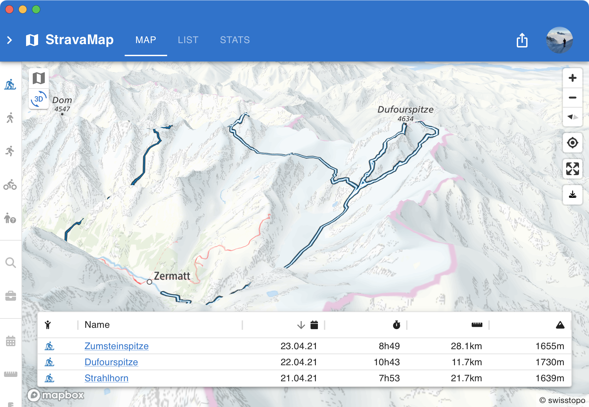
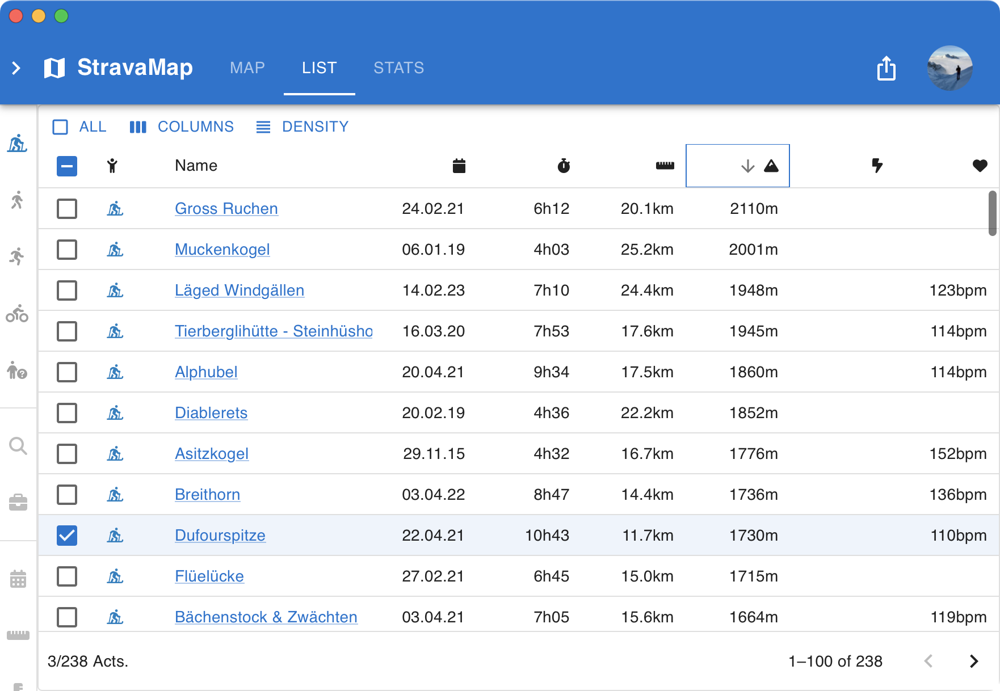
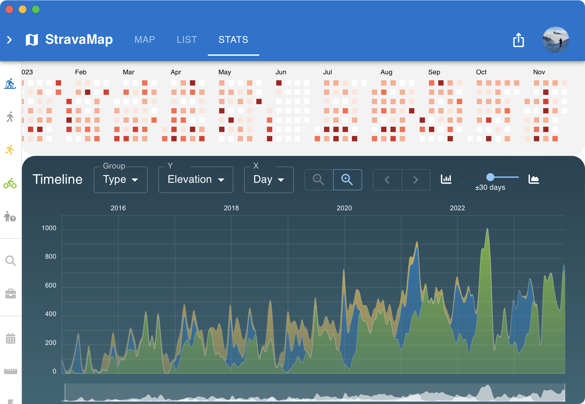

## What is StravaMap?

Ever wanted to see all your outdoor activities on a single _map_? With multiple map providers, the advanced filtering? Even 3D?

Or simply have a sortable and filterable list of all activities?

And maybe even some statistics? Scatter plots, timeline plots, violin plots, and more?

Then [StravaMap](https://wirhabenzeit.github.io/stravamap/?athlete=6824046) is for you!

## Features

- Statically generated website
- Webhooks for automatic updates
- Customizable map
- Open Source on [GitHub](https://github.com/wirhabenzeit/stravamap)

## Technologies

- [React](https://reactjs.org/)
- [Mapbox](https://www.mapbox.com/)
- [Strava API](https://developers.strava.com/)
- [Supabase](https://supabase.io/)
- [Material UI](https://material-ui.com/)
- [d3](https://d3js.org/)
