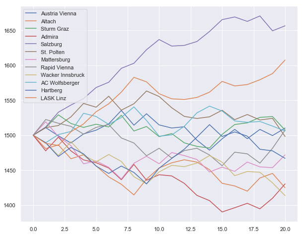
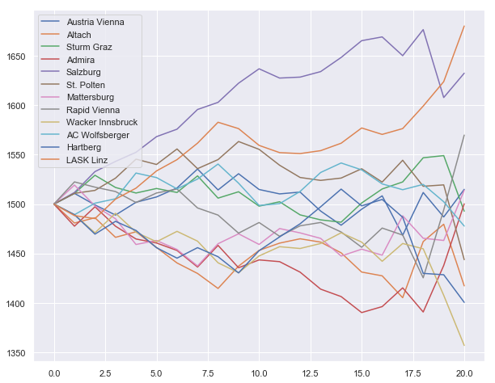
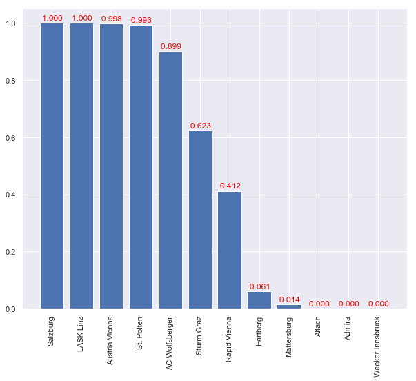

```python
import numpy as np
import copy
import scipy as sp
import csv
import matplotlib.pyplot as plt
import seaborn as sns
import operator
sns.set()
```

```python
# Import past results
past_results = []
with open('AUT.csv') as csvfile:
    readCSV = csv.reader(csvfile, delimiter=',')
    numGames = 0
    for row in readCSV:
        if row[2]=="2018/2019":
            past_results.append({"ht": row[5], "at": row[6], "hg": int(row[7]), "ag": int(row[8]), "round": numGames//6})
            numGames += 1
numRounds=numGames//6

# Future matches
remaining_matches = [('LASK Linz','Wacker Innsbruck'),
                     ('Salzburg',"Sturm Graz"),
                     ('Austria Vienna',"Altach"),
                     ('Mattersburg','Rapid Vienna'),
                     ("Admira",'St. Polten'),
                     ('Hartberg','AC Wolfsberger'),
                     ("Sturm Graz","Austria Vienna"),
                     ("Rapid Vienna","Hartberg"),
                     ("St. Polten","Mattersburg"),
                     ("Wacker Innsbruck","Salzburg"),
                     ("Altach","LASK Linz"),
                     ("AC Wolfsberger","Admira")]

# Extract a list of teams
teams = []
for result in past_results:
    if result['ht'] not in teams:
        teams.append(result['ht'])

# Compute current standings
points = {}
goals_scored = {}
goals_conceded = {}
goals = {}
for team in teams:
    points[team] = 0
    goals[team] = 0
    goals_scored[team] = 0
    goals_conceded[team] = 0
for result in past_results:
    goals_scored[result["ht"]] += result["hg"]
    goals_conceded[result["ht"]] += result["ag"]
    goals_scored[result["at"]] += result["ag"]
    goals_conceded[result["at"]] += result["hg"]
    goals[result["at"]] += result["ag"] - result["hg"]
    points[result["ht"]] += 3 if result["hg"]>result["ag"] else 0 if result["hg"]<result["ag"] else 1
    points[result["at"]] += 0 if result["hg"]>result["ag"] else 3 if result["hg"]<result["ag"] else 1
for team in teams:
    goals[team] = goals_scored[team] - goals_conceded[team]
```

```python
class eloPredictor():
    def __init__(self,
                 homefield_adv=100,
                 weight=lambda nRound:20,
                 expected_result=lambda DeltaH: 1/(10**(-DeltaH/400)+1),
                 probs_from_E=lambda E: [1-E-np.exp(-(E-.5)**2/2/.28**2)/3/2,np.exp(-(E-.5)**2/2/.28**2)/3,E-np.exp(-(E-.5)**2/2/.28**2)/3/2]):
        self.score_rate = {}
        self.concede_rate = {}
        self.probs_from_E = probs_from_E
        self.weight = weight
        self.elo = {}
        self.homefield_adv = homefield_adv
        self.__expected_result__ = expected_result

        # Compute elo from past results
        for team in teams:
            self.elo[team] = [1500]
            self.score_rate[team] = goals_scored[team]/numRounds
            self.concede_rate[team] = goals_conceded[team]/numRounds
        for result in past_results:
            G = (abs(result["hg"]-result["ag"])+11)/8
            W = 1 if result["hg"]>result["ag"] else 0 if result["hg"]<result["ag"] else .5
            Wh = self.expected_result(result["ht"],result["at"])
            Wa = 1 - Wh
            self.elo[result["ht"]].append(self.elo[result["ht"]][-1]+self.weight(result["round"])*G*(W-Wh))
            self.elo[result["at"]].append(self.elo[result["at"]][-1]+self.weight(result["round"])*G*(1-W-Wa))

    # compute adjusted elo diff with homefield advantage
    def elo_diff(self,teamH,teamA):
        return self.elo[teamH][-1] - self.elo[teamA][-1] + self.homefield_adv

    # compute expected result using supplied formula
    def expected_result(self,teamA,teamB):
        return self.__expected_result__(self.elo_diff(teamA,teamB))

    # compute winning probabilities from expected result and supplied formula
    def probabilities(self,teamA,teamB):
        E = self.expected_result(teamA,teamB)
        return self.probs_from_E(E)
        pD = self.pDraw(E)
        pW = E - pD/2
        pL = 1 - pD - pW
        return[pL,pD,pW]

    # plot elo development
    def plot_elo_history(self):
        plt.figure(num=None, figsize=(10, 8), facecolor='w', edgecolor='k')
        for team, elos in self.elo.items():
            plt.plot(elos,label=team)
        plt.legend()
        plt.show()

    # compute probability of advancing to the next round from sampling
    def advProb(self,nSample=1000):
        self.points_after = copy.copy(points)
        self.match_results = {}
        for match in remaining_matches:
            self.match_results[match] = np.random.choice([0,1,3], nSample, p=self.probabilities(match[0],match[1]))
            match_resultsA = copy.copy(self.match_results[match])
            match_resultsA[match_resultsA == 3] = -1
            match_resultsA[match_resultsA == 0] = 3
            match_resultsA[match_resultsA == -1] = 0
            self.points_after[match[0]] += self.match_results[match]
            self.points_after[match[1]] += match_resultsA

        # Count number of samples where each team is in the top six
        # Rule for equal points: sort teams by goals from past games
        self.numTopSix = {team: 0 for team in teams}
        for k in range(nSample):
            points_temp = {team: [self.points_after[team][k],goals[team]] for team in teams}
            for team in sorted(points_temp, key=points_temp.get, reverse=True)[:6]:
                self.numTopSix[team] += 1
        orderedTeams = sorted(self.numTopSix, key=lambda x: self.numTopSix[x],reverse=True)
        return {team: self.numTopSix[team]/nSample for team in orderedTeams}

    def advProbPois(self,nSample=1000):
        self.points_after = copy.copy(points)
        self.goals = copy.copy(goals)
        self.match_results = {}
        for match in remaining_matches:
            goalsA = np.random.poisson(lam=(self.score_rate[match[0]]+self.concede_rate[match[1]])/2,size=nSample)
            goalsB = np.random.poisson(lam=(self.score_rate[match[1]]+self.concede_rate[match[0]])/2,size=nSample)
            self.goals[match[0]] += goalsA
            self.goals[match[1]] += goalsB
            self.points_after[match[0]] += np.array([3 if gA>gB else 0 if gA<gB else 1 for (gA,gB) in zip(goalsA.tolist(),goalsB.tolist())])
            self.points_after[match[1]] += np.array([0 if gA>gB else 3 if gA<gB else 1 for (gA,gB) in zip(goalsA.tolist(),goalsB.tolist())])
        self.numTopSix = {team: 0 for team in teams}
        for k in range(nSample):
            points_temp = {team: [self.points_after[team][k],self.goals[team][k]] for team in teams}
            for team in sorted(points_temp, key=points_temp.get, reverse=True)[:6]:
                self.numTopSix[team] += 1
        orderedTeams = sorted(self.numTopSix, key=lambda x: self.numTopSix[x],reverse=True)
        return {team: self.numTopSix[team]/nSample for team in orderedTeams}

    # plot advancing probabilities
    def plot_adv_prob(self,nSample=1000,method="elo"):
        if method=="elo":
            probs=self.advProb(nSample=nSample)
        else:
            probs=self.advProbPois(nSample=nSample)
        plt.figure(num=None, figsize=(10, 8), facecolor='w', edgecolor='k')
        plt.xticks(rotation='vertical')
        plt.bar(probs.keys(),probs.values())
        for i in range(12):
            plt.text(x = i-.72 , y = list(probs.values())[i]+.01, s = "{:10.3f}".format(list(probs.values())[i]), size = 12,color="red")
        plt.show()
```

## ELO history

With default parameters

```python
eloPredictor().plot_elo_history()
```



Without homefield advantage

```python
eloPredictor(homefield_adv=0).plot_elo_history()
```


Double weight for the last five rounds

```python
eloPredictor(weight=lambda round: 60 if round > 15 else 20).plot_elo_history()
```



## Prediction from ELO rating

Default parameters

```python
eloPredictor().plot_adv_prob(nSample=50000)
```



Assuming that in the remaining matches draw/win/loss are equally likely

```python
eloPredictor(probs_from_E=lambda E: [1-E,0,E]).plot_adv_prob(nSample=10000)
```


Assuming that the last five rounds carry a bigger weight. This changes the ELO development (see above)

```python
eloPredictor(weight=lambda round: 60 if round > 14 else 20).plot_adv_prob(nSample=50000)
```


## Poisson sampling

```python
eloPredictor().plot_adv_prob(nSample=100000,method="Pois")
```


