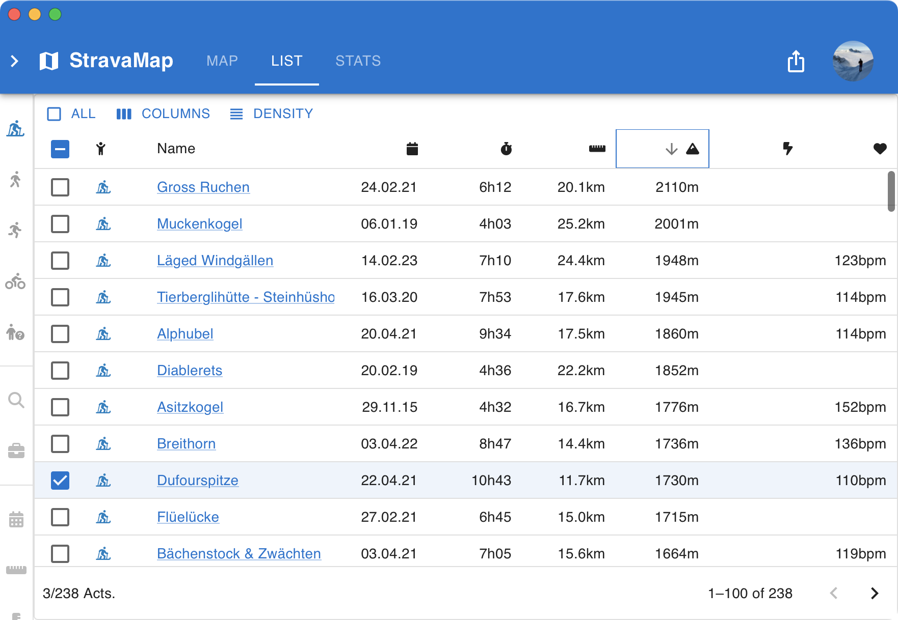
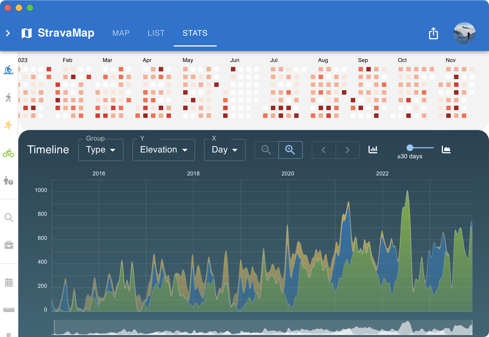

Map, list, and analyze of all your Strava activities.

[Github](https://github.com/wirhabenzeit/stravamap)

[Demo](https://wirhabenzeit.github.io/stravamap/?athlete=6824046)

## Features

- Filter by _distance_, _elevation_, _date_, _sports type_, ...
- Automatically add/remove/update Strava activities via [webhook](https://developers.strava.com/docs/webhooks/)
- Share all/selected activities with friends & family
- Static website, no server required. All data is stored in [supabase](https://supabase.com/)
- easy to customize and extend

### Map View

- Wide range of map styles and overlays
- Shareable map screenshots
- Overlays of biking and hiking routes


### List View

- Customizable columns
- Sortable columns



### Stats View

- Calendar heatmap
- Timeline of total distance/elevation/time per period of time, with local averaging
- Configurable scatter plot of all activities
- Violin plot of elevation/distance/time per activity, grouped by period of time, or sports type



## Dependencies

- [strava](https://www.strava.com/)
- [mapbox](https://www.mapbox.com/)
- [react](https://reactjs.org/)
- [vite](https://vitejs.dev/)
- [react-map-gl](https://visgl.github.io/react-map-gl/)
- [react-router](https://reactrouter.com/)
- [mui](https://mui.com/)
- [supabase](https://supabase.com/)
- [fontawesome](https://fontawesome.com/)

## Architecture

- [Github Pages](https://pages.github.com/) for hosting the static website
- [supabase](https://supabase.com/) for storing the data
- [supabase functions](https://supabase.com/docs/guides/functions) for handling the webhook and fetching the data from Strava
- [Github Actions](https://github.com/features/actions) for automatically deploying the app to Github Pages and the edge functions to supabase, and periodically refreshing the Strava tokens

## Setup

### Create a MapBox account

Note down your `access_token`

### Create a supabase account

Note down your `supabase_url` and `supabase_anon_key`

### Create a Strava app

Note down your `strava_client_id` and `strava_client_secret`

### Setup supabase

Use `supabase/schema.sql` to create the required tables locally and in supabase.

### Environment variables

Create a `.env` file in the root directory of your project with the following content:

```bash
VITE_MAPBOX_TOKEN=[your mapbox access token]
VITE_STRAVA_CLIENT_ID=[your strava client id]
VITE_BASEPATH=/
VITE_SUPABASE_URL=[your local supabase url]
VITE_SUPABASE_ANON_KEY=[your local supabase anon key]
```

In your github repository, add the following secrets:

```bash
VITE_MAPBOX_TOKEN=[your mapbox access token]
VITE_STRAVA_CLIENT_ID=[your strava client id]
VITE_BASPATH=/[your repository name]
VITE_SUPABASE_URL=[your public supabase url]
VITE_SUPABASE_ANON_KEY=[your public supabase anon key]
```

Create a `supabase/.env` file wit hthe following content:

```bash
STRAVA_CLIENT_ID=[your strava client id]
STRAVA_CLIENT_SECRET=[your strava client secret]
```

Push the `supabase/.env` file to your supabase project:

```bash
supabase secrets set --env-file ./supabase/.env
```

### Commit your changes to Github

This will automatically deploy your app to github pages and the edge functions to supabase.

### Setup webhook

Run the following command to register the webhook with Strava:

```bash
curl -X POST https://www.strava.com/api/v3/push_subscriptions \
      -F client_id=[your strava client id] \
      -F client_secret=[your strava client secret] \
      -F callback_url=https://[your supabase project ref].supabase.co/functions/v1/strava-webhook \
      -F verify_token=STRAVA
```

### Fetch your activities

Login to your StravaMap, go to the settings page and click on the `Fetch Activities` button. Due to the Strava API rate limits, you can only fetch 200 activities at a time, and at most 15 times per hour.

## Caveats

- Due to the server-less nature of this project, your activity data is essentially publicly visible.
- Everything is read only. You can't manually edit or delete activities in the app. You have to do this in Strava.
