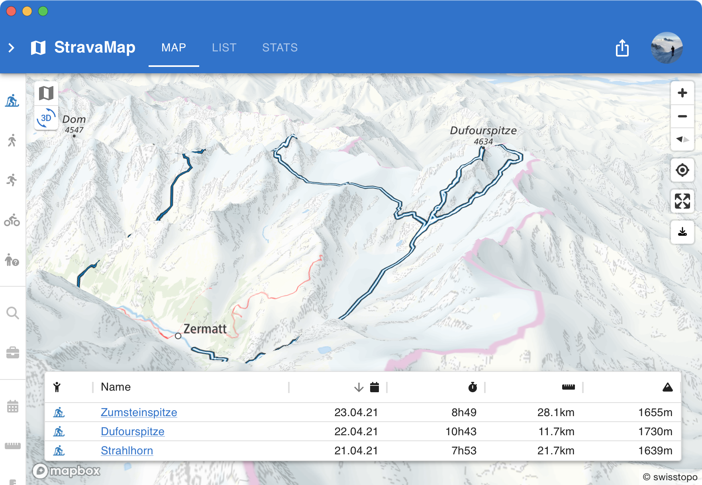
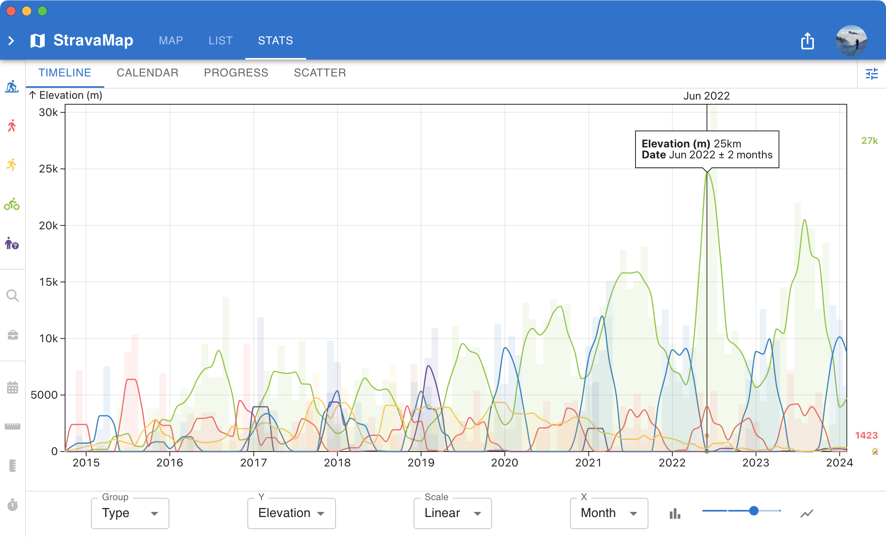
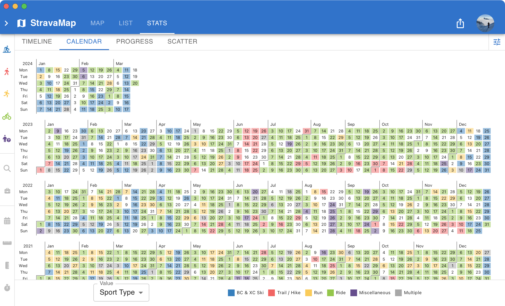

Map, list, and analyze of all your Strava activities.

[Github](https://github.com/wirhabenzeit/activitymap)

[Demo](https://activitymap.dominik.page/map?activities=7593088562%2C5458243467%2C7366932446%2C7474744362%2C9027929337%2C3874409911%2C4841842664%2C8559741301%2C5172459135%2C3781386708)

## Features

- Filter by _distance_, _elevation_, _date_, _sports type_, ...
- Automatically add/remove/update Strava activities via [webhook](https://developers.strava.com/docs/webhooks/)
- Share all/selected activities with friends & family
- easy to customize and extend

### Map View

- Wide range of map styles and overlays
- Shareable map screenshots
- Overlays of biking and hiking routes



### List View

- Customizable columns
- Sortable columns


### Stats View

- Calendar heatmap
- Timeline of total distance/elevation/time per period of time, with local averaging
- Configurable scatter plot of all activities
- Progress plot per year or month




## Dependencies

- [react](https://reactjs.org/)
- [strava](https://www.strava.com/)
- [mapbox](https://www.mapbox.com/)
- [TanStack Table](https://tanstack.com/table/latest)
- [Observable Plot](https://observablehq.com/@observablehq/plot)

## Setup

### Create a MapBox account

You'll need your `access_token`

### Create a Strava app

You'll need your `strava_client_id` and `strava_client_secret`

### Setup a PosgreSQL database

(Vercel Postgres)[https://vercel.com/docs/solutions/postgres] is free and easy to setup.

### Install the dependencies

```bash
pnpm install
```

### Setup authentication

```bash
npx auth secret
```

to generate a secret for your authentication.

### Environment variables

Create a `.env` file in the root directory of your project and add the appropriate environment variables:

```bash
# POSTGRES
POSTGRES_URL=
POSTGRES_PRISMA_URL=
POSTGRES_URL_NO_SSL=
POSTGRES_URL_NON_POOLING=
POSTGRES_USER=
POSTGRES_HOST=
POSTGRES_PASSWORD=
POSTGRES_DATABASE=

# AUTH
AUTH_SECRET=
AUTH_STRAVA_ID=
AUTH_STRAVA_SECRET=

# MAPBOX
NEXT_PUBLIC_MAPBOX_TOKEN=
```

### Setup Database

```bash
pnpm db:push
```

### Start the development server

```bash
pnpm dev
```

### Build

```bash
pnpm build
```
