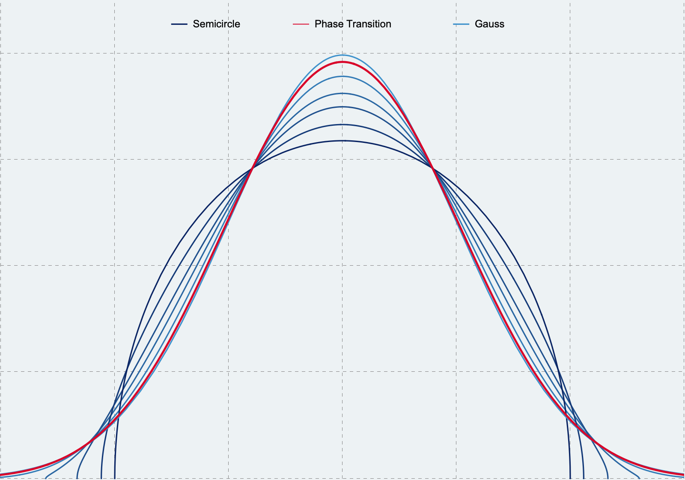

import PDFViewer from "@/components/PDFViewer";

## Summary

{frontmatter.description}

The density of states

$$
\rho(x,q):= \frac{\sqrt{1-q}}{\pi \sqrt{1-(1-q) x^2/4}}\prod_{k=1}^\infty \frac{1-q^{2 k+2}}{1-q^{2 k+1}}\left(1-\frac{(1-q) x^2 q^k}{(1+q^k)^2}\right)
$$

interpolates between the Gaussian and semicircular densities

$$
\rho(x,0) = \frac{\sqrt{4-x^2}}{2\pi},\qquad \rho(x,1)=\frac{\exp(-x^2/2)}{\sqrt{2\pi}}.
$$

 

## Abstract

We prove that the empirical density of states of quantum spin glasses on arbitrary graphs converges to a normal distribution as long as the maximal degree is negligible compared with the total number of edges. This extends the recent results of Keating et al. (2014) that were proved for graphs with bounded chromatic number and with symmetric coupling distribution. Furthermore, we generalise the result to arbitrary hypergraphs. We test the optimality of our condition on the maximal degree for $p$-uniform hypergraphs that correspond to $p$-spin glass Hamiltonians acting on $n$ distinguishable spin-1/2 particles. At the critical threshold $p = n^{1/2}$ we find a sharp classical-quantum phase transition between the normal distribution and the Wigner semicircle law. The former is characteristic to classical systems with commuting variables, while the latter is a signature of noncommutative random matrix theory.

## Paper

<PDFViewer url={`https://arxiv.org/pdf/${frontmatter.arxiv}.pdf`} />
