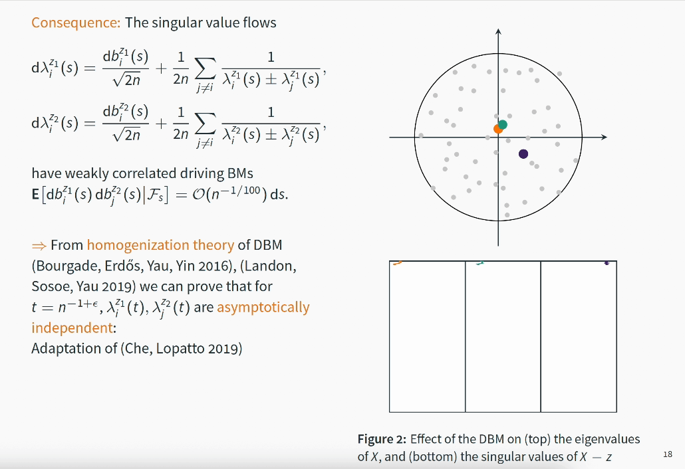

## Summary

{frontmatter.description}

 

### Main result

We study the fluctuations around the well known circular law, which asserts that the eigenvalues $\sigma_1,\ldots,\sigma_n$ of a random matrix with suitably scaled IID entries asymptotically are uniformly distributed on the unit disc in the sense

$$
\frac{1}{n}\sum_i f(\sigma_i) \approx \frac{1}{\pi}\int_D f(z)\, \mathrm d^2 z.
$$

Here we prove the corresponding CLT

$$
\sum_i f(\sigma_i) \approx \mathcal N\Bigl(0,\frac{1}{4\pi}\lVert f\rVert_{L^2(D)}^2 + \frac{1}{2}\lVert f\rVert_{\dot H^{1/2}(\partial D)} + \kappa_4 \lvert \langle f\rangle_D - \langle f\rangle_{\partial D}\rvert^2 \Bigr)
$$

extending previous result for analytic test functions $f$ or Gaussian matrices. The first two terms in the variance may be interpreted as the _Gaussian Free Field_ on the unit disc.

### Proof

One key ingredient of the proof is the asymptotic independence of singular value flows for sufficiently distant spectral parameters after a short time:

## Abstract

We consider large non-Hermitian random matrices X with complex, independent, identically distributed centred entries and show that the linear statistics of their eigenvalues are asymptotically Gaussian for test functions having 2+ϵ derivatives. Previously this result was known only for a few special cases; either the test functions were required to be analytic [Rider, Silverstein 2006], or the distribution of the matrix elements needed to be Gaussian [Rider, Virág 2007], or at least match the Gaussian up to the first four moments [Tao, Vu 2016; Kopel 2015]. We find the exact dependence of the limiting variance on the fourth cumulant that was not known before. The proof relies on two novel ingredients: (i) a local law for a product of two resolvents of the Hermitisation of X with different spectral parameters and (ii) a coupling of several weakly dependent Dyson Brownian Motions. These methods are also the key inputs for our analogous results on the linear eigenvalue statistics of real matrices X that are presented in the companion paper [Cipolloni, Erdős, Schröder 2019](./200202438).

## Paper
